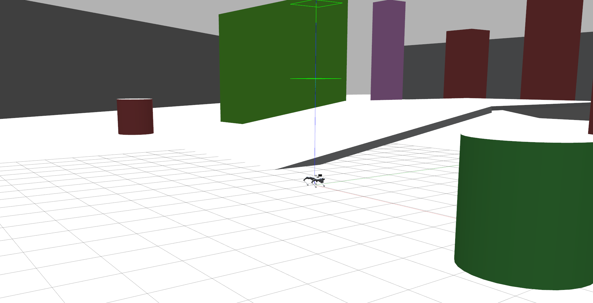
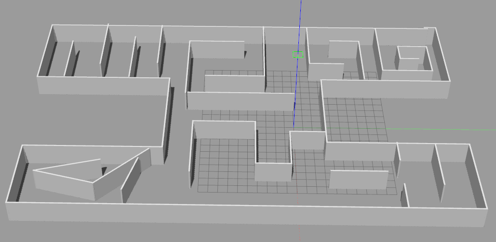

# Gazebo Go2(W) Quadbot Simulation
This repository contains the Gazebo simulation environment and URDF description for the Go2 Quadbot robot, equipped with a Livox Mid-360 LiDAR sensor and GPS module.

Forked from [gazebo_go2_simulation](https://github.com/dfl-rlab/gz_quadbot.git)

Livox lidar simulation is based on: 
- [official_gazebo9_ros1](https://github.com/Livox-SDK/livox_laser_simulation)
- [gazebo11_ros2_version](https://github.com/inkccc/mid360_simulation)

Running environment refer to: [gazebo_env_dockerfile](https://github.com/dfl-rlab/dddmr_navigation/blob/main/dddmr_docker/docker_file/Dockerfile_x64_gazebo)

# Additional Features
- **add gps sensor**: before running, set latitude_deg / longitude_deg / elevation / heading_deg in xx.world to set the gps origin
- **add livox lidar**: set lidar mounting pose in [xacro](robots/descriptions/go2_description/xacro/robot_VLP.xacro). If you don't need livox or velodyne, comment out the corresponding lines.
- **add more worlds**: see [worlds](robot_scene/worlds)

| World | Scene Type | Overview |
|-------|------|----------|
|outdoor_slope | outdoor, closure, multi floor, no stairs |  |
|indoor_room1 | indoor, closure, multi room, no stairs |  |
|see [worlds](robot_scene/worlds) |  |  |

To use specific world with sdf resource, copy the following sdf model files
- https://github.com/leonhartyao/gazebo_models_worlds_collection/tree/master/models
- https://github.com/HongbiaoZ/autonomous_exploration_development_environment/tree/humble/src/vehicle_simulator/mesh

to one of the following directories:
- [robot_scene/models/](robot_scene/models)
- ~/.gazebo/models/:


Launch with:
```bash
# Go2 run
ros2 launch robot_scene go2_lidar_gps.launch.py
# Go2w run
ros2 launch robot_scene go2w_lidar_gps.launch.py
# Diffbot run
ros2 launch robot_scene diffbot_lidar_gps.launch.py
```

To control the robot from keyboard, new terminal run:
```bash
ros2 run teleop_twist_keyboard teleop_twist_keyboard
```


# Topics List
| Topic | Type |
|-------|------|
| /body_pose | geometry_msgs/msg/Pose |
| /cmd_vel | geometry_msgs/msg/Twist |
| /gps/data | sensor_msgs/msg/NavSatFix |
| /gps_plugin/vel | geometry_msgs/msg/Vector3Stamped |
| /livox/imu | sensor_msgs/msg/Imu |
| /livox/lidar | sensor_msgs/msg/PointCloud2 |
| /robot_description | std_msgs/msg/String |
| /tf | tf2_msgs/msg/TFMessage |
| /tf_static | tf2_msgs/msg/TFMessage |

The simulation already publishes the static tf within this robot and its sensor mounted on it.

---

# go2_sim_ws 补充：Point-LIO 建图

> 以下由本工作区维护，**上游内容保持原样**。完整的坑位记录、根因分析和参数速查见
> [`docs/quickstart.md`](docs/quickstart.md)，本节只放最常用的命令。

## 依赖

本工作区已自包含：`point_lio`、`ign_sim_pointcloud_tool`、`robot_scene`、`champ_*`、
`go2_config`、`mid360_simulation` 都在 `src/GazeboQuadbot/` 下。
唯一的编译期外部依赖 `livox_ros_driver2` 由 `~/.bashrc` 里的
`source /home/ros/ros_ws/livox_ros/install/setup.sh` 提供。

## 编译

```bash
cd /home/ros/ros_ws/go2_sim_ws
colcon build --symlink-install

# 只改了 LIO / 点云 / 场景时
colcon build --packages-select point_lio ign_sim_pointcloud_tool robot_scene --symlink-install
```

> 不用装 `libunwind-dev`（`point_lio/package.xml` 里那条是多余的，CMakeLists 和源码都没用到）。

## 仿真 + 建图（两个终端）

仿真和 LIO 是两个独立 launch，各自启停。两个终端都要先：

```bash
source /home/ros/ros_ws/go2_sim_ws/install/setup.bash
```

**终端 1 —— 只起 Gazebo：**

```bash
ros2 launch robot_scene go2_lidar_gps.launch.py                    # 带界面
ros2 launch robot_scene go2_lidar_gps.launch.py headless:=True     # 无界面（RTF ~0.44 vs ~0.36，雷达 4.7 vs 2.7 Hz）
```

**终端 2 —— 只起 LIO 建图 + RViz：**

```bash
ros2 launch robot_scene go2_lio.launch.py
```

`headless:=True` 有两点要注意：

- **必须写大写 `True`** —— champ 用 `PythonExpression([" not ", headless])` 判断，小写 `true` 会 abort；
- **启动后等约 50 秒**雷达才出数据 —— 该 launch 会在 50 秒时自动订阅 scan 话题唤醒传感器
  （传感器没有 `always_on`，必须有人订阅才激活）。想调延时用 `activate_delay:=30.0`，
  但**别调太小**，过早激活会让 gzserver 段错误。

- ⚠️ **不要给仿真 launch 加 `gui:=false`** — 那只是关掉 gzclient，雷达传感器就没人激活了，一条数据都没有（见 quickstart 坑 3）
- ⚠️ **不要在两个终端里都起 LIO** —— 两个 Point-LIO 会抢发 TF `camera_init→aft_mapped`，RViz 画面会乱
- 确认 `point_lio` 解析到本工作区：`ros2 pkg prefix point_lio`

> 注意：默认 world 已从 `garage.world` 改为 `robot_scene/worlds/indoor_walls1.world`
> （`garage.world` 依赖缺失的 `model://garage` 且是**零重力**的无人机世界，见 quickstart 坑 2）。

## 控制行走

```bash
ros2 run teleop_twist_keyboard teleop_twist_keyboard          # i/,/j/l/k

ros2 topic pub -r 20 /cmd_vel geometry_msgs/msg/Twist "{linear: {x: 0.3}}"   # 前进
ros2 topic pub -r 20 /cmd_vel geometry_msgs/msg/Twist "{linear: {y: 0.2}}"   # 侧移
```

champ 需要**持续**指令（`--once` 只挪一下）。速度上限：`x` ±1.0 / `y` ±0.5 / `z` ±1.2 m/s。

## 建图产物与在 RViz 里的可见性

| 话题 | 是什么 | 频率 |
|---|---|---|
| `/cloud_registered` | **当前帧**特征点（世界系 `camera_init`），跟着机器人跑 | ~4 Hz |
| `/Laser_map` | 初始化那一瞬间的快照，**只发布一次** | 一次性 |
| `point_lio/PCD/scans.pcd` | **真正的累积地图**，只在正常退出时写 | 退出时一次 |

> ⚠️ 这个版本的 Point-LIO **不持续发布累积地图**（`pcl_wait_pub` 在
> `laserMapping.cpp:180` 声明了但从未被 publish）。所以 RViz 里看到的是当前帧点云
> 在环境里移动，**不是**逐渐长出来的地图。
> 要拿到整张图必须 **Ctrl-C 正常退出**（`kill -9` 不会写 PCD），
> 输出在 `src/GazeboQuadbot/point_lio/PCD/scans.pcd`。

## 停止

```bash
pkill -f pointlio_mapping          # 先优雅退 LIO，会写 PCD
pkill -x gzserver; pkill -x gzclient; pkill -x rviz2
```